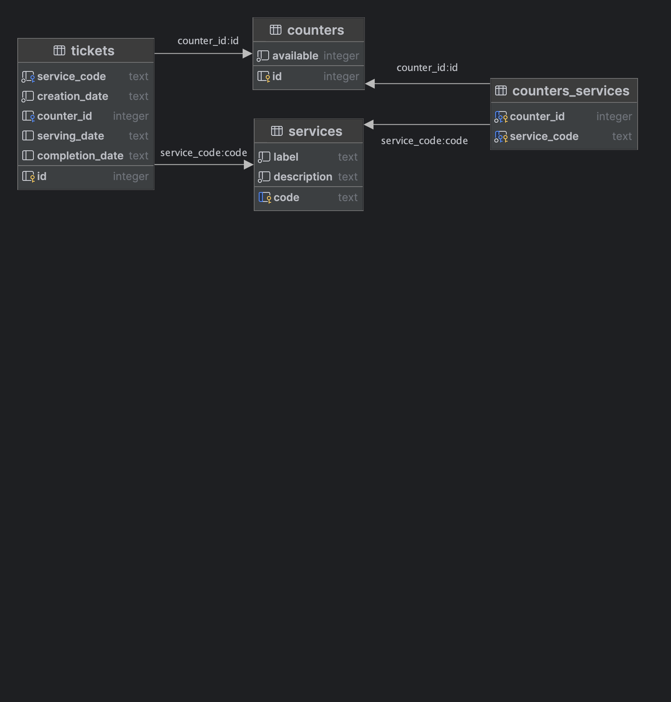

# Database Schema

## Tables
### services
- code (text): uniquely identifies the service
- label (text): human-readable name of the service
- description (text): human-readable description of the service
### counters
- id (integer): uniquely identifies the counter
- available (integer): whether the counter is available (1) or not (0)
### counters_services
- counter_id (integer): identifies the counter
- service_code (text): identifies the service
This table is used to define which services are available at which counters.
### tickets
- id (integer): uniquely identifies the ticket
- service_code (text): identifies the service requested by the ticket
- counter_id (integer): identifies the counter that is serving the ticket (NULL if the ticket is not being served)
- creation_date (text): time when the ticket was created in ISO 8601 format (YYYY-MM-DD HH:MM:SS)
- serving_date (text): time when the ticket started being served in ISO 8601 format (YYYY-MM-DD HH:MM:SS) (NULL if the ticket is not being served)
- completion_date (text): time when the ticket was completed in ISO 8601 format (YYYY-MM-DD HH:MM:SS) (NULL if the ticket is not completed)
